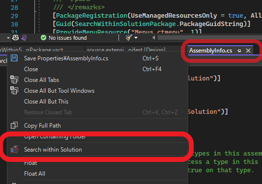
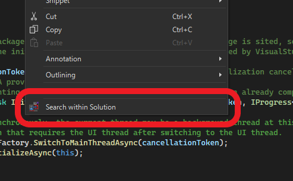

# Search Within Solution

- Visual Studio Extension
- This extension adds a "Search Within Solution" item to the document context menu.
- Selecting the "Search Within Solution" item will make the files in the solution selected.

## usage

"Search within Solution" item has been added to the context menu of the Document tab.

Selecting the "Search within Solution" item will make the corresponding document in the Solution selected.

"Search within Solution" item has also been added to the right-click menu on the document.

---

## Privacy Policy

[PrivacyPolicy](./privacypolicy.md)

---

## Download 

[Search Within Solution 2022, link to VS-Marketplace](https://marketplace.visualstudio.com/items?itemName=ChisatoK.SearchWithinSolution2022)

---

## History

- for VS2022 (2022/11/07)

